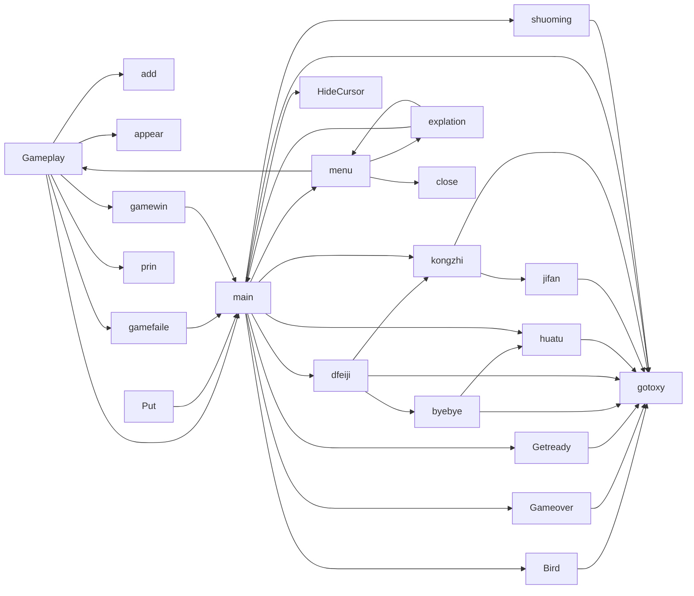

# C-Language-Games-master函数调用关系(仅用户编写函数)

```mermaid
graph LR
Bird-->gotoxy
Gameover-->gotoxy
Gameplay-->add
Gameplay-->appear
Gameplay-->gamefaile
Gameplay-->gamewin
Gameplay-->main
Gameplay-->prin
Getready-->gotoxy
Put-->main
byebye-->gotoxy
byebye-->huatu
dfeiji-->byebye
dfeiji-->gotoxy
dfeiji-->kongzhi
explation-->main
explation-->menu
gamefaile-->main
gamewin-->main
huatu-->gotoxy
jifan-->gotoxy
kongzhi-->gotoxy
kongzhi-->jifan
main-->Bird
main-->Gameover
main-->Getready
main-->HideCursor
main-->dfeiji
main-->gotoxy
main-->huatu
main-->kongzhi
main-->menu
main-->shuoming
menu-->Gameplay
menu-->close
menu-->explation
shuoming-->gotoxy
```

