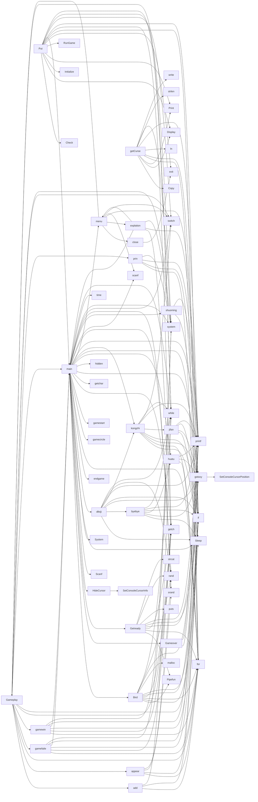

# C-Language-Games-master函数调用关系

```mermaid
graph LR
Bird-->Pipefun
Bird-->Sleep
Bird-->for
Bird-->getch
Bird-->gotoxy
Bird-->if
Bird-->malloc
Bird-->printf
Bird-->rand
Bird-->while
Gameover-->gotoxy
Gameover-->printf
Gameplay-->add
Gameplay-->appear
Gameplay-->for
Gameplay-->gamefaile
Gameplay-->gamewin
Gameplay-->getch
Gameplay-->if
Gameplay-->main
Gameplay-->prin
Gameplay-->switch
Gameplay-->system
Gameplay-->while
Getready-->Pipefun
Getready-->for
Getready-->getch
Getready-->gotoxy
Getready-->if
Getready-->printf
Getready-->puts
Getready-->rand
Getready-->strcat
HideCursor-->SetConsoleCursorInfo
Put-->Check
Put-->Display
Put-->Initialize
Put-->Print
Put-->RunGame
Put-->exit
Put-->for
Put-->getch
Put-->if
Put-->main
Put-->switch
Put-->system
Put-->while
add-->for
add-->if
add-->while
appear-->for
appear-->if
appear-->rand
appear-->srand
byebye-->Sleep
byebye-->gotoxy
byebye-->huatu
byebye-->if
byebye-->printf
byebye-->while
close-->exit
dfeiji-->Sleep
dfeiji-->byebye
dfeiji-->gotoxy
dfeiji-->if
dfeiji-->kongzhi
dfeiji-->printf
dfeiji-->rand
dfeiji-->while
explation-->getch
explation-->main
explation-->menu
explation-->printf
explation-->system
gamefaile-->for
gamefaile-->getch
gamefaile-->if
gamefaile-->main
gamefaile-->printf
gamefaile-->system
gamewin-->for
gamewin-->getch
gamewin-->if
gamewin-->main
gamewin-->printf
gamewin-->system
getCurse-->Copy
getCurse-->Display
getCurse-->Print
getCurse-->for
getCurse-->if
getCurse-->ln
getCurse-->printf
getCurse-->strlen
getCurse-->system
getCurse-->write
gotoxy-->SetConsoleCursorPosition
huatu-->for
huatu-->gotoxy
huatu-->printf
jifan-->Sleep
jifan-->gotoxy
jifan-->if
jifan-->printf
kongzhi-->Sleep
kongzhi-->for
kongzhi-->gotoxy
kongzhi-->if
kongzhi-->jifan
kongzhi-->printf
kongzhi-->switch
kongzhi-->while
main-->Bird
main-->Gameover
main-->Getready
main-->HideCursor
main-->Scanf
main-->Sleep
main-->System
main-->dfeiji
main-->endgame
main-->for
main-->gamecircle
main-->gamestart
main-->getch
main-->getchar
main-->gotoxy
main-->hidden
main-->huatu
main-->if
main-->kongzhi
main-->menu
main-->printf
main-->rand
main-->scanf
main-->shuoming
main-->srand
main-->switch
main-->system
main-->time
main-->while
menu-->Gameplay
menu-->close
menu-->explation
menu-->printf
menu-->scanf
menu-->switch
prin-->for
prin-->if
prin-->printf
prin-->system
shuoming-->gotoxy
shuoming-->printf
```

