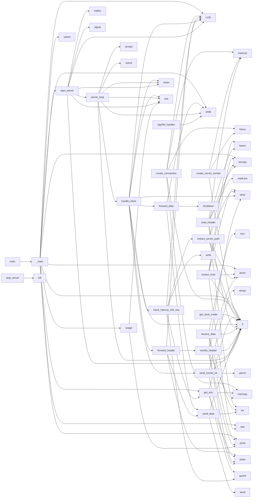

# E:\Code\C++\LinuxHw\cmake-build-debug\Testing\mproxy-master函数调用关系

```mermaid
graph LR
_main-->LOG
_main-->atoi
_main-->get_info
_main-->if
_main-->printf
_main-->start_server
_main-->strchr
_main-->strncpy
_main-->switch
_main-->usage
_main-->while
create_connection-->LOG
create_connection-->htons
create_connection-->if
create_connection-->memcpy
create_connection-->memset
create_server_socket-->htons
create_server_socket-->if
create_server_socket-->memset
extract_host-->atoi
extract_host-->bzero
extract_host-->if
extract_host-->strchr
extract_host-->strncpy
extract_host-->strstr
extract_server_path-->if
extract_server_path-->strchr
extract_server_path-->strncpy
extract_server_path-->strstr
forward_data-->send_data
forward_data-->shutdown
forward_data-->while
forward_header-->LOG
forward_header-->rewrite_header
forward_header-->send_data
forward_header-->strlen
get_info-->if
get_info-->memcpy
get_info-->sprintf
get_info-->strlen
get_work_mode-->if
hand_mproxy_info_req-->LOG
hand_mproxy_info_req-->extract_server_path
hand_mproxy_info_req-->get_info
hand_mproxy_info_req-->sprintf
hand_mproxy_info_req-->write
handle_client-->LOG
handle_client-->close
handle_client-->exit
handle_client-->forward_data
handle_client-->forward_header
handle_client-->hand_mproxy_info_req
handle_client-->if
handle_client-->send_tunnel_ok
handle_client-->strstr
main-->_main
read_header-->bzero
read_header-->for
read_header-->if
read_header-->memset
read_header-->readLine
read_header-->strncpy
receive_data-->for
receive_data-->if
receive_data-->printf
receive_data-->recv
rewrite_header-->if
rewrite_header-->memcpy
rewrite_header-->printf
rewrite_header-->strchr
rewrite_header-->strlen
rewrite_header-->strstr
send_data-->for
send_data-->if
send_data-->send
send_tunnel_ok-->if
send_tunnel_ok-->perror
send_tunnel_ok-->strcpy
send_tunnel_ok-->strlen
server_loop-->accept
server_loop-->close
server_loop-->exit
server_loop-->handle_client
server_loop-->if
server_loop-->sizeof
server_loop-->while
sigchld_handler-->while
start_server-->LOG
start_server-->close
start_server-->exit
start_server-->if
start_server-->malloc
start_server-->server_loop
start_server-->signal
stop_server-->kill
usage-->exit
usage-->printf
```

