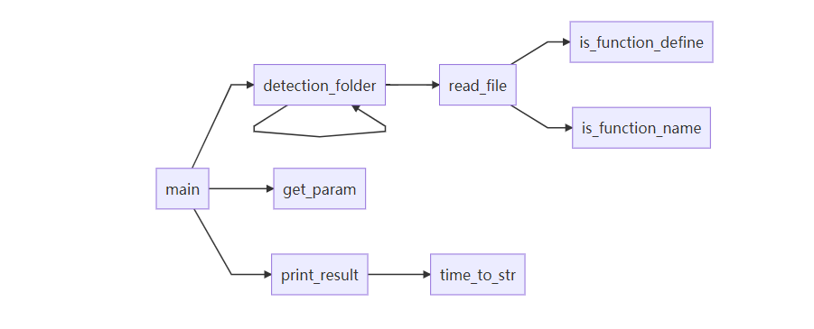

# 打印C语言代码的函数调用关系

## 1. 使用Clion和Ubuntu进行远程开发

#### 本地

- Windows 10
- Clion 2021.3.1

#### 服务器

- 阿里云ECS
- Ubuntu 20.04
- Cmake 3.21.4
- Gcc 9.3.0
- gdbserver 9.2

## 2. 具体的设计方法实现

2.1 从控制台获取参数

- 输入目标项目文件夹
- 是否只考虑用户编写的函数
- 默认为C语言，是否转为C++

2.2 遍历文件夹

- 遍历文件夹下所有代码文件

    - 逐行读取文件

        - 是否为函数定义

            - 是则暂存
            - 否则加入到函数调用关系map

2.3 打印函数之间的调用关系

- 使用markdown语法画图，推荐使用Typora打开查看，目前其他markdown软件对画图支持不太好

2.4 作业函数的调用关系如下：

## 3. 运行示例

3.1 测试项目：[mproxy: c 语言实现的一个最小的http代理](./Testing/mproxy-master)

​	只打印用户编写的函数：[推荐使用Typora查看](./Testing/mproxy-master函数调用关系(仅用户编写的函数).md)

​	打印所有匹配的函数：[推荐使用Typora查看](./Testing/mproxy-master函数调用关系.md)

3.2 测试项目：

​	只打印用户编写的函数：[推荐使用Typora查看](./Testing/C-Language-Games-master函数调用关系(仅用户编写函数).md)

​	打印所有匹配的函数：[推荐使用Typora查看](./Testing/C-Language-Games-master函数调用关系.md)

## 4. 不足与改进

+ 无法读取跨行函数声明

+ 无法读取同一行内的多个函数

+ 无法匹配所有函数声明

+ 无法准确过滤函数，对于一些变量声明也会错误匹配

